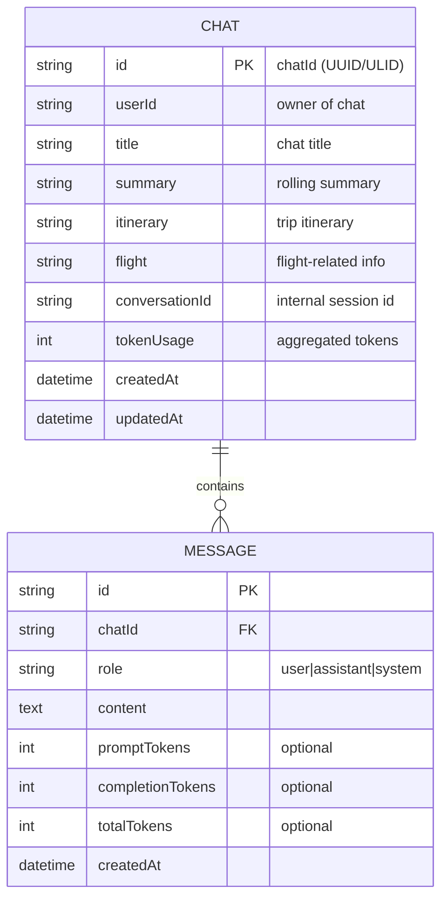
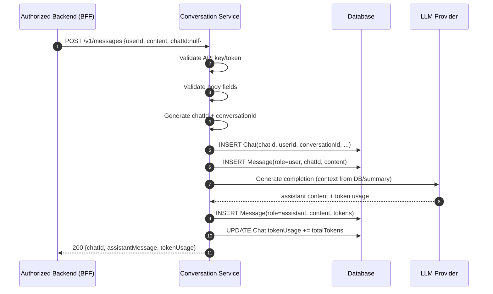
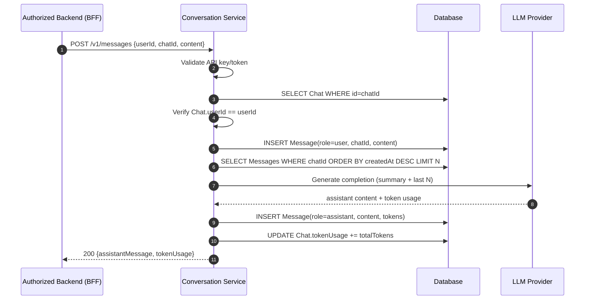
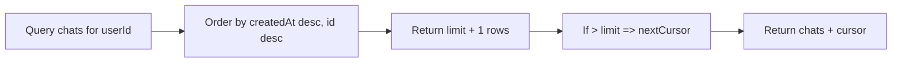
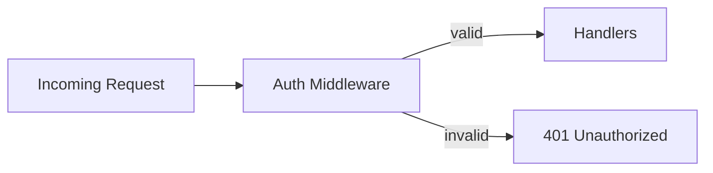
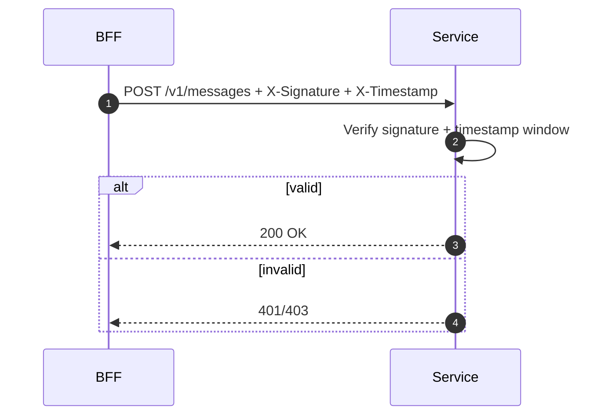
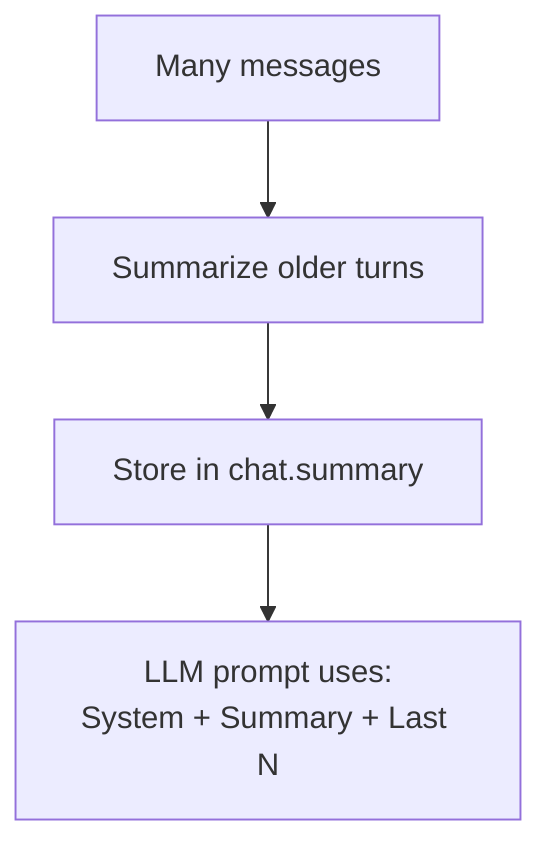

# Conversation Backend Architecture (Chat + Message) — Detailed Design

> **Purpose:** A backend service that manages multi-chat conversations per user, generates `chatId` internally, preserves context via `conversationId`, persists messages, and ensures **only an authorized backend** can call the API.

---

## Table of Contents
1. [Glossary](#glossary)  
2. [Requirements](#requirements)  
3. [Non-goals](#non-goals)  
4. [High-level System Overview](#high-level-system-overview)  
5. [Architecture Diagrams](#architecture-diagrams)  
6. [Core Flows](#core-flows)  
7. [API Contracts](#api-contracts)  
8. [Security](#security)  
9. [Database Schema](#database-schema)  
10. [Token Usage & Cost Tracking](#token-usage--cost-tracking)  
11. [Observability](#observability)  
12. [Reliability, Scaling & Performance](#reliability-scaling--performance)  
13. [Error Handling](#error-handling)  
14. [Appendix: Example Payloads](#appendix-example-payloads)  

---

## Glossary

| Term | Meaning |
|---|---|
| **chatId** | Public identifier returned to caller to continue a chat thread. Generated by this service. |
| **conversationId** | Internal session/context identifier used to manage LLM context and summarization strategies. |
| **BFF** | Backend-for-Frontend / authorized backend that is allowed to call this API (not the browser). |
| **Message** | A single turn from a `role` (user/assistant/system). |
| **Token Usage** | Prompt + completion token counts from LLM responses for cost/usage tracking. |
| **Idempotency Key** | A key to avoid duplicate writes on retries (e.g., user double-click). |

---

## Requirements

### Functional
- Support **multiple chats per user**.
- Support **multiple messages per chat**, ordered and retrievable.
- **First message**: if `chatId` is missing, create a new chat and return a newly generated `chatId`.
- **Subsequent messages**: require the `chatId` to continue context.
- Persist messages reliably and return assistant reply.
- Provide fields on Chat:
  - `title`, `summary`, `itinerary`, `flight` (metadata fields for your trip planner style use-cases)
  - `tokenUsage` aggregated over the chat

### Security
- Only an authorized backend can call this service:
  - API key or token-based auth (minimum)
  - Strongly recommended: rotation, IP allowlist, mTLS, request signing, rate limiting

### Operational
- Must be observable: logs, metrics, traces
- Must scale horizontally
- Must be safe against cross-user access (chatId guessing / leakage)

---

## Non-goals
- Frontend directly calling conversation service (not allowed).
- Real-time streaming UI design details (optional extension).
- Calendar modifications (not part of this backend).

---

## High-level System Overview

### What the client sees
- On the first message, client **does not have** `chatId`.
- Backend returns `chatId`.
- Client stores and sends `chatId` for all subsequent messages.

### What the service controls
- `chatId` generation
- `conversationId` management
- persistence + retrieval
- auth + authorization + auditing

---

## Architecture Diagrams

### 1) Component Diagram (Mermaid)

```mermaid
flowchart LR
  subgraph Client Side
    UI[Frontend UI\n(Web/Mobile)]
  end

  subgraph Server Side
    BFF[Authorized Backend\n(BFF/API Gateway)]
    S[Conversation Service\n(this backend)]
    DB[(Database\nChat + Message)]
    LLM[LLM Provider]
    SECRETS[(Secrets / Key Store)]
  end

  UI -->|send message\n+ chatId if known| BFF
  BFF -->|Authorization token / API key| S
  S -->|validate key/token| SECRETS
  S --> DB
  S -->|prompt + context| LLM
  LLM -->|assistant reply + token usage| S
  S -->|assistant reply + chatId| BFF
  BFF --> UI
```

---

### 2) Deployment Diagram (Mermaid)

```mermaid
flowchart TB
  subgraph VPC[Cloud VPC]
    LB[Load Balancer]
    SVC[Conversation Service\n(stateless pods)]
    CACHE[(Optional Cache\nRedis)]
    DB[(SQL DB\nPostgres/MySQL)]
    QUEUE[(Optional Queue\nfor async summary/title)]
  end

  subgraph Managed[Managed Services]
    SECRETS[Secret Manager]
    LLM[LLM Provider]
    LOGS[Logging/Monitoring]
  end

  LB --> SVC
  SVC --> DB
  SVC --> CACHE
  SVC --> QUEUE
  SVC --> SECRETS
  SVC --> LLM
  SVC --> LOGS
```

> **Key idea:** Service is stateless; all state is in DB (and optional cache).

---

### 3) Data Model (ER Diagram)



---

## Core Flows

## Flow A — First message (chatId missing)
### Steps
1. **Authenticate** request (API key/token)
2. Validate inputs (`userId`, `content`)
3. Create `chatId` + `conversationId`
4. Insert Chat row
5. Insert user Message row
6. Build LLM request context (system prompt + optional summary + recent messages)
7. Call LLM provider
8. Insert assistant Message row
9. Update `Chat.tokenUsage`
10. Return response including new `chatId`

### Sequence Diagram


---

## Flow B — Subsequent message (chatId present)
### Steps
1. Authenticate request
2. Load Chat by `chatId`
3. Verify chat ownership: `Chat.userId == userId`
4. Insert user Message
5. Retrieve message history (or summary + last N messages)
6. Call LLM
7. Insert assistant Message + update tokens
8. Return assistant response

### Sequence Diagram


---

## Flow C — Chat listing and pagination (recommended)
- Use cursor pagination to keep performance stable.
- `GET /v1/chats?userId=...&limit=20&cursor=...`
- Cursor can be `(createdAt, id)` tuple.



---

## API Contracts

> **All endpoints require authentication** (API key/token). This service should NOT be publicly reachable from browser JS.

### Authentication headers
- Preferred:
  - `Authorization: Bearer <token>`
- Alternate:
  - `x-api-key: <key>`

---

## 1) Send Message (creates chat if missing)
**POST** `/v1/messages`

#### Request
```json
{
  "userId": "user_123",
  "chatId": null,
  "content": "Plan a 3-day Goa trip",
  "metadata": {
    "clientMessageId": "optional-idempotency-key",
    "source": "web"
  }
}
```

#### Response
```json
{
  "chatId": "chat_9f0a6c3d-8db0-4c86-9e35-2cddbf7b6b1d",
  "assistantMessage": "Sure — here’s a 3-day itinerary...",
  "tokenUsage": {
    "promptTokens": 1200,
    "completionTokens": 450,
    "totalTokens": 1650
  }
}
```

**Behavior**
- If `chatId` is null/absent:
  - create new Chat + conversationId
- If `chatId` is present:
  - validate ownership and append message to that chat

---

## 2) List Chats
**GET** `/v1/chats?userId=user_123&limit=20&cursor=...`

#### Response
```json
{
  "items": [
    {
      "id": "chat_...",
      "title": "Goa Trip",
      "summary": "3-day plan with beaches + food",
      "tokenUsage": 8200,
      "createdAt": "2026-01-08T10:00:00Z"
    }
  ],
  "nextCursor": "opaque_cursor_or_null"
}
```

---

## 3) Fetch Messages for a Chat
**GET** `/v1/chats/{chatId}/messages?limit=50&cursor=...`

#### Response
```json
{
  "items": [
    {"role":"user","content":"Plan Goa trip","createdAt":"..."},
    {"role":"assistant","content":"Sure...","createdAt":"..."}
  ],
  "nextCursor": null
}
```

---

## 4) Update Chat Metadata (title/summary/itinerary/flight)
**PATCH** `/v1/chats/{chatId}`

#### Request
```json
{
  "title": "Goa Trip Plan",
  "summary": "Short summary...",
  "itinerary": "Day 1... Day 2...",
  "flight": "IndiGo 6E..."
}
```

---

## Security

## 1) Minimum: API key / token auth
### Check
- Verify the incoming header matches a valid key/token.
- Return:
  - `401 Unauthorized` for missing/invalid
  - `403 Forbidden` if token is valid but lacks scope (optional)



---

## 2) Prevent cross-user access
Even if someone guesses a `chatId`, they must not read/append to it unless they are the owner.

**Rule**
- `SELECT chat WHERE id = chatId`
- Check `chat.userId == request.userId`
- Else reject `403 Forbidden`

---

## 3) Strongly recommended hardening
### A) Rotate tokens/keys
- Use Secret Manager
- Support multiple active keys during rotation window

### B) IP allowlist (if stable egress IP)
- Only allow requests from known backend IP ranges

### C) mTLS (best for backend-to-backend)
- Mutual TLS ensures the caller is your service

### D) HMAC request signing (replay protection)
- Sender signs body with shared secret; receiver verifies.
- Include timestamp + nonce to prevent replay.



### E) Rate limiting
- Per API key + per userId
- Return `429 Too Many Requests`

---

## Database Schema

## Chat table
| Column | Type | Required | Notes |
|---|---:|:---:|---|
| id | UUID/ULID | ✅ | generated by service |
| userId | TEXT | ✅ | indexed |
| title | TEXT | ❌ | can auto-generate |
| summary | TEXT | ❌ | rolling summary |
| itinerary | TEXT/JSON | ❌ | travel output field |
| flight | TEXT/JSON | ❌ | travel output field |
| conversationId | TEXT | ✅ | internal session id |
| tokenUsage | BIGINT | ✅ | aggregated |
| createdAt | TIMESTAMP | ✅ | default now |
| updatedAt | TIMESTAMP | ✅ | auto-update |

## Message table
| Column | Type | Required | Notes |
|---|---:|:---:|---|
| id | UUID/ULID | ✅ | PK |
| chatId | UUID/ULID | ✅ | FK + indexed |
| role | TEXT/ENUM | ✅ | user/assistant/system |
| content | TEXT | ✅ | |
| promptTokens | INT | ❌ | useful for auditing |
| completionTokens | INT | ❌ | useful for auditing |
| totalTokens | INT | ❌ | useful for auditing |
| createdAt | TIMESTAMP | ✅ | default now |

---

## Suggested SQL DDL (Example)

```sql
CREATE TABLE chat (
  id              UUID PRIMARY KEY,
  user_id         TEXT NOT NULL,
  title           TEXT,
  summary         TEXT,
  itinerary       TEXT,
  flight          TEXT,
  conversation_id TEXT NOT NULL,
  token_usage     BIGINT NOT NULL DEFAULT 0,
  created_at      TIMESTAMP NOT NULL DEFAULT NOW(),
  updated_at      TIMESTAMP NOT NULL DEFAULT NOW()
);

CREATE INDEX idx_chat_user_created ON chat (user_id, created_at DESC);

CREATE TABLE message (
  id                UUID PRIMARY KEY,
  chat_id           UUID NOT NULL REFERENCES chat(id) ON DELETE CASCADE,
  role              TEXT NOT NULL CHECK (role IN ('user','assistant','system')),
  content           TEXT NOT NULL,
  prompt_tokens     INT,
  completion_tokens INT,
  total_tokens      INT,
  created_at        TIMESTAMP NOT NULL DEFAULT NOW()
);

CREATE INDEX idx_message_chat_created ON message (chat_id, created_at ASC);
```

---

## Token Usage & Cost Tracking

### Strategy 1: Chat-only aggregation (simple)
- Only store `chat.tokenUsage`
- On each LLM response:
  - `chat.tokenUsage += totalTokens`

### Strategy 2: Per-message + aggregation (recommended)
- Store tokens per message + also keep chat total
- Benefits:
  - per-turn cost analysis
  - debugging and usage reporting
  - accurate audits

```mermaid
flowchart LR
  LLM[LLM response\n(prompt/completion tokens)] --> M[Insert assistant message\ntokens columns]
  M --> C[Update chat.tokenUsage += totalTokens]
```

---

## Observability

### Logs
- request id / trace id
- userId (be careful with PII policy)
- chatId
- latency, status codes
- LLM call duration + token usage

### Metrics
- request count by endpoint/status
- p95 latency
- LLM call p95
- token usage per minute
- DB errors, timeouts, queue depth (if async)

### Tracing
- Add distributed tracing across:
  - BFF → Conversation Service → DB/LLM

---

## Reliability, Scaling & Performance

### Stateless service
- Horizontally scalable replicas behind a load balancer

### DB indexes
- `chat(userId, createdAt desc)` for chat listing
- `message(chatId, createdAt asc)` for replaying history

### Context window control
When chat becomes long:
- Use `chat.summary` + last N messages
- Update summary periodically (sync or async)



### Idempotency
- Accept `clientMessageId`
- Store a mapping or unique constraint like:
  - `(chatId, clientMessageId)` unique
- If duplicate: return previously generated assistant response

---

## Error Handling

| Code | Meaning | When |
|---:|---|---|
| 400 | Bad Request | missing userId/content, invalid json |
| 401 | Unauthorized | missing/invalid key/token |
| 403 | Forbidden | chat belongs to another user |
| 404 | Not Found | unknown chatId |
| 409 | Conflict | idempotency conflict / duplicate |
| 429 | Too Many Requests | rate limited |
| 500 | Internal Error | unexpected failures |
| 503 | Service Unavailable | DB/LLM outage/timeouts |

---

## Appendix: Example Payloads

### Example: First message
```http
POST /v1/messages
Authorization: Bearer <token>
Content-Type: application/json

{
  "userId": "user_123",
  "content": "Plan me a trip to Jaipur",
  "metadata": { "clientMessageId": "msg_001" }
}
```

### Example: Continue chat
```http
POST /v1/messages
Authorization: Bearer <token>
Content-Type: application/json

{
  "userId": "user_123",
  "chatId": "chat_9f0a6c3d-8db0-4c86-9e35-2cddbf7b6b1d",
  "content": "Make it budget-friendly",
  "metadata": { "clientMessageId": "msg_002" }
}
```

---

## Final Notes
- Your original schema is fully supported.
- The “recommended” columns (per-message token fields, updatedAt, idempotency keys) are optional but strongly helpful in real systems.
